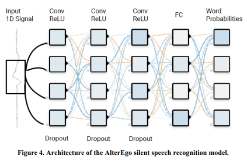

# David Gaddy and Dan Klein

## TOC

1. [About](#about)
2. [Digital Voicing of Silent Speech](#digital-voicing-of-silent-speech)

## About

This document analyses the open-source [sEMG Silent Speech dataset](https://zenodo.org/record/4064409#.YW1DrxrMKUk) and it's
related [force-aligned phoneme dataset](https://github.com/dgaddy/silent_speech_alignments/raw/main/text_alignments.tar.gz) which is released along with the published paper
[`Digital Voicing of Silent Speech`](https://arxiv.org/pdf/2010.02960.pdf) and their further paper [`An Improved
Model for Voicing Silent Speech`](https://arxiv.org/pdf/2106.01933.pdf).

This document also discusses the methods and reasoning behind their approach
used in the two papers and how they could be possibly be improved upon along
with recent papers which have been released which also take inspiration from
these publications.

## Digital Voicing of Silent Speech

This paper was the initial paper which was published by the authors and
denotes the main ideas behind their approach and how it differs to other
approachs.

The main idea behind this paper is to digitally reconstruct a persons voice
only using EMG data recorded from a persons face and throat while they are
silently voicing speech. The idea behind this is similar to the project below:

    

However, the approach used in the `MIT AlterEgo` project is relatively
simple compared to the one used in the `Digital Voicing` paper. Below
we can see a general overview of the machine learning model used in
the `MIT AlterEgo` project.

   

